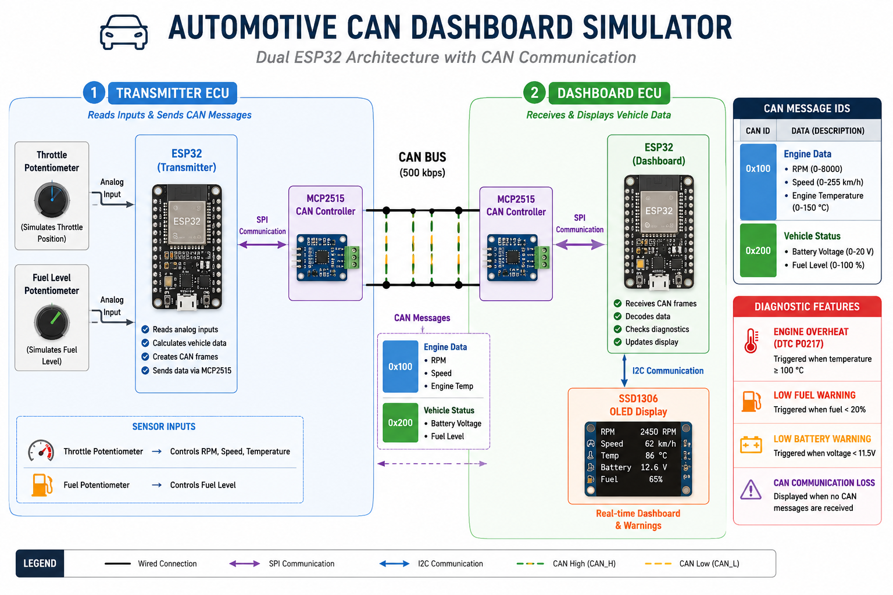

# Automotive CAN Dashboard Simulator

> **Status:** 🚧 Project in Progress
>
> The hardware and software are fully functional. I am currently adding final project photos, demonstration videos, and documentation.

---

# Overview

The **Automotive CAN Dashboard Simulator** is a real-time embedded systems project that simulates communication between automotive Electronic Control Units (ECUs) using a Controller Area Network (CAN).

The system uses **two ESP32 development boards**, **two MCP2515 CAN controllers**, and an **SSD1306 OLED display** to demonstrate how vehicle information is transmitted, decoded, and displayed across a CAN network.

The transmitter ECU reads live analog inputs from potentiometers, converts them into simulated vehicle data, packages the information into multiple CAN messages, and transmits it over the CAN bus. The dashboard ECU receives the messages, decodes the data, updates the OLED display, and monitors vehicle warning conditions.

---

# Demo Video

🎥 **Coming Soon**

The demonstration video will include:

- Hardware overview
- System architecture
- Wiring explanation
- Live dashboard operation
- CAN communication
- Diagnostic warnings
- Complete project walkthrough

---

# System Architecture

<p align="center">

</p>

---

# Wiring Diagram

<p align="center">

</p>

---

# Features

- Dual ESP32 ECU architecture
- Real-time CAN Bus communication (500 kbps)
- Multiple CAN Message IDs
- OLED dashboard display
- Real-time RPM simulation
- Vehicle speed simulation
- Engine temperature monitoring
- Battery voltage monitoring
- Fuel level monitoring
- Potentiometer-based throttle simulation
- Potentiometer-based fuel level simulation
- Engine Overheat Diagnostic (DTC P0217)
- Low Fuel warning
- Low Battery indicator
- CAN communication loss detection

---

# Hardware

| Component | Quantity |
|-----------|---------:|
| ESP32 Development Board | 2 |
| MCP2515 CAN Controller | 2 |
| SSD1306 OLED Display | 1 |
| Potentiometer | 2 |
| Breadboard | 2 |
| Jumper Wires | Multiple |

---

# Software

- Arduino IDE
- Embedded C++
- MCP_CAN Library
- Adafruit GFX Library
- Adafruit SSD1306 Library

---

# How It Works

## Transmitter ECU

The transmitter continuously reads two potentiometers.

### Throttle Potentiometer

Controls:

- Engine RPM (800–6000 RPM)
- Vehicle Speed (0–120 MPH)
- Engine Temperature (70–110 °C)

### Fuel Potentiometer

Controls:

- Fuel Level (0–100%)

The ESP32 packages this information into multiple CAN frames and transmits the messages over the CAN bus.

---

## Dashboard ECU

The dashboard ECU continuously listens for incoming CAN messages.

After receiving each message it:

- Decodes CAN data
- Updates the OLED dashboard
- Checks diagnostic conditions
- Displays vehicle warnings
- Detects CAN communication loss

---

# CAN Message IDs

| CAN ID | Description | Data |
|---------|-------------|------|
| **0x100** | Engine ECU | RPM, Speed, Engine Temperature |
| **0x200** | Vehicle Status ECU | Battery Voltage, Fuel Level |

Using multiple CAN IDs better represents how different ECUs communicate in a real automotive CAN network.

---

# Dashboard Functions

The OLED dashboard continuously displays:

- Engine RPM
- Vehicle Speed
- Engine Temperature
- Battery Voltage
- Fuel Level

Values update in real time as CAN messages are received.

---

# Diagnostic Features

## Engine Overheat (DTC P0217)

When engine temperature reaches **100 °C or higher**, the dashboard displays:

- ENGINE OVERHEAT
- Diagnostic Trouble Code **P0217**

The warning automatically clears once the temperature returns below the threshold.

---

## Low Fuel Warning

When fuel level drops to **20% or lower**, the dashboard displays a Low Fuel warning.

The warning automatically clears when fuel rises above the threshold.

---

## Low Battery Indicator

Battery voltage is continuously monitored.

When voltage falls to **11.5 V or lower**, the dashboard displays a Low Battery indicator.

---

## CAN Communication Loss

If no CAN messages are received for more than **3 seconds**, the dashboard displays:

```text
NO CAN SIGNAL
