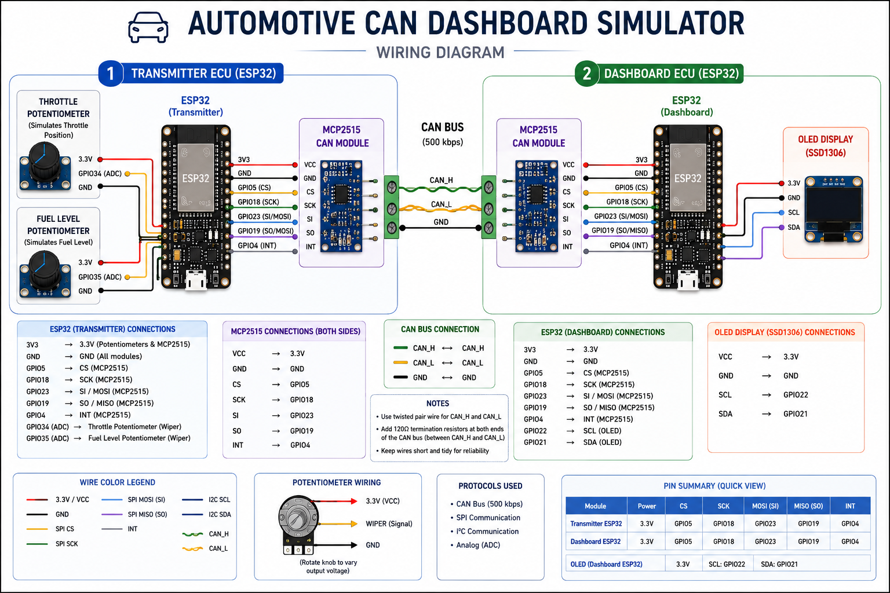
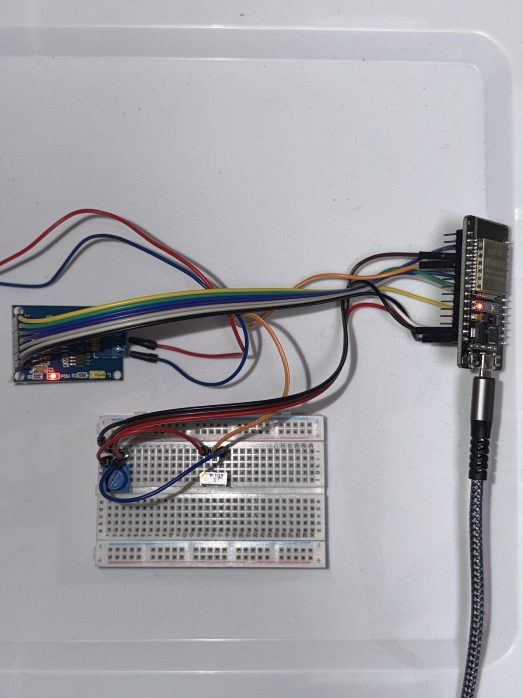

# Automotive CAN Dashboard Simulator

> **Status:** 🚧 **Project in Progress**
> The project is fully functional. I am currently adding final documentation, hardware photos, wiring diagrams, and a demonstration video.

---

## Overview

The **Automotive CAN Dashboard Simulator** is a real-time embedded systems project that simulates communication between automotive Electronic Control Units (ECUs) using a Controller Area Network (CAN).

The system uses **two ESP32 development boards**, **two MCP2515 CAN controllers**, and an **SSD1306 OLED display** to demonstrate how vehicle information is transmitted, decoded, and displayed across a CAN network.

The transmitter ECU reads live analog inputs from potentiometers, converts them into simulated vehicle data, packages the information into multiple CAN messages, and transmits it over the CAN bus. The dashboard ECU receives the messages, decodes the data, updates the OLED display, and monitors vehicle warning conditions.

---

## Demo Video

🎥 **Coming Soon**

A complete walkthrough demonstrating:

* Hardware overview
* System architecture
* Wiring explanation
* Live dashboard operation
* CAN communication
* Diagnostic warnings
* Full project explanation

---

## System Architecture

<p align="center">

</p>

---

## Wiring Diagram

<p align="center">

</p>

---

## Features

* Dual ESP32 ECU architecture
* Real-time CAN Bus communication (500 kbps)
* Multiple CAN Message IDs
* OLED dashboard display
* Real-time RPM simulation
* Vehicle speed simulation
* Engine temperature monitoring
* Battery voltage monitoring
* Fuel level monitoring
* Potentiometer-based throttle simulation
* Potentiometer-based fuel level simulation
* Engine Overheat Diagnostic (DTC P0217)
* Low Fuel warning
* Low Battery indicator
* CAN communication loss detection

---

## Hardware

| Component               | Quantity |
| ----------------------- | -------- |
| ESP32 Development Board | 2        |
| MCP2515 CAN Controller  | 2        |
| SSD1306 OLED Display    | 1        |
| Potentiometer           | 2        |
| Breadboard              | 2        |
| Jumper Wires            | Multiple |

---

## Software

* Arduino IDE
* Embedded C++
* MCP_CAN Library
* Adafruit GFX Library
* Adafruit SSD1306 Library

---

## How It Works

### Transmitter ECU

The transmitter ESP32 continuously reads two potentiometers.

**Throttle Potentiometer**

Controls:

* Engine RPM (800–6000 RPM)
* Vehicle Speed (0–120 MPH)
* Engine Temperature (70–110 °C)

**Fuel Potentiometer**

Controls:

* Fuel Level (0–100%)

The transmitter packages this information into CAN messages and sends them across the CAN bus.

---

### Dashboard ECU

The dashboard ESP32 receives incoming CAN messages and:

* Decodes the data
* Updates the OLED dashboard
* Checks for warning conditions
* Displays diagnostic information when necessary
* Detects CAN communication loss

---

## CAN Message IDs

| CAN ID    | Description        | Data                           |
| --------- | ------------------ | ------------------------------ |
| **0x100** | Engine ECU         | RPM, Speed, Engine Temperature |
| **0x200** | Vehicle Status ECU | Battery Voltage, Fuel Level    |

Using multiple CAN IDs better represents how different ECUs communicate on a real automotive CAN network.

---

## Dashboard Display

The OLED dashboard displays:

* Engine RPM
* Vehicle Speed
* Engine Temperature
* Battery Voltage
* Fuel Level

Values update continuously as new CAN messages are received.

---

## Diagnostics

### Engine Overheat (DTC P0217)

When engine temperature reaches **100 °C or higher**, the dashboard displays:

* ENGINE OVERHEAT
* Diagnostic Trouble Code **P0217**

The warning clears automatically once the temperature returns below the threshold.

---

### Low Fuel

When fuel level drops to **20% or lower**, a Low Fuel warning is displayed.

The warning clears automatically once the fuel level rises above the threshold.

---

### Low Battery

When battery voltage drops to **11.5 V or lower**, the dashboard displays a Low Battery indicator.

---

### CAN Communication Loss

If no CAN messages are received for more than **3 seconds**, the dashboard displays:

```
NO CAN SIGNAL
```

---

## Project Photos

### Complete System

<p align="center">

</p>

---

### Transmitter ECU

<p align="center">

</p>

---

### Dashboard ECU

<p align="center">

</p>

---

### Dashboard Display

<p align="center">

</p>

---

### Engine Overheat Warning

<p align="center">

</p>

---

### Low Fuel Warning

<p align="center">

</p>

---

## Repository Structure

```
Automotive-CAN-Dashboard-Simulator
│
├── transmitter_esp32/
│   └── transmitter_esp32.ino
│
├── receiver_dashboard_esp32/
│   └── receiver_dashboard_esp32.ino
│
├── diagrams/
│   ├── system_architecture.png
│   └── system_wiring_diagram.png
│
├── images/
│   ├── complete_setup.jpg
│   ├── transmitter.jpg
│   ├── receiver.jpg
│   ├── dashboard.jpg
│   ├── overheat_warning.jpg
│   └── low_fuel_warning.jpg
│
├── LICENSE
└── README.md
```

---

## Skills Demonstrated

* Embedded Systems
* Embedded C++
* ESP32 Programming
* Controller Area Network (CAN)
* MCP2515 CAN Controller
* SPI Communication
* I²C Communication
* Analog-to-Digital Conversion (ADC)
* Real-Time Embedded Programming
* Automotive Diagnostics (DTC)
* Sensor Simulation
* Hardware Integration
* Embedded Debugging

---

## Future Improvements

Potential future enhancements include:

* Additional ECU nodes
* CAN data logging
* OBD-II integration
* Bluetooth connectivity
* Wi-Fi dashboard
* Mobile application support
* SD card logging
* Real automotive sensors

---

## Author

**Abid Ahmad**

Electrical & Computer Engineering
Wayne State University

**GitHub:** https://github.com/abid-ahmad

**LinkedIn:** *(Add your LinkedIn profile URL here once available.)*
